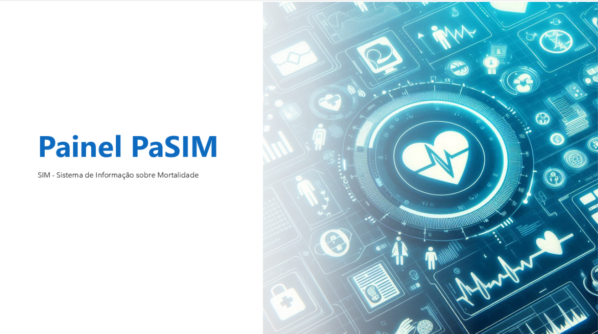
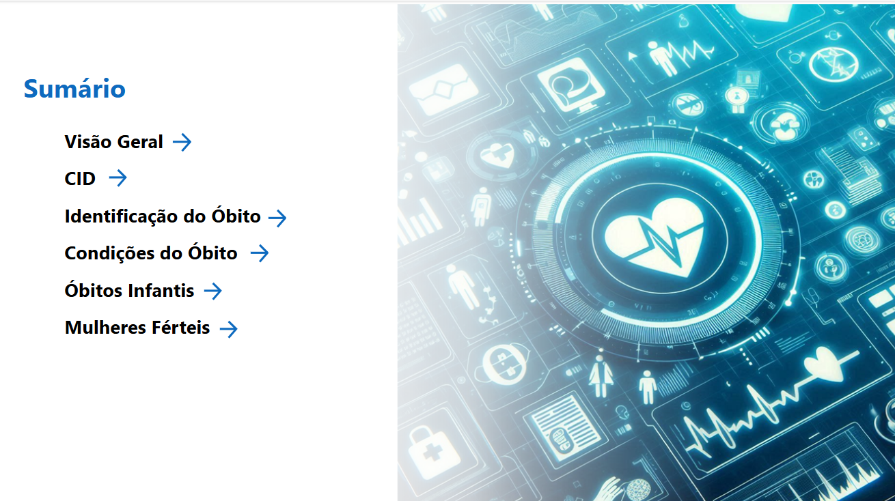
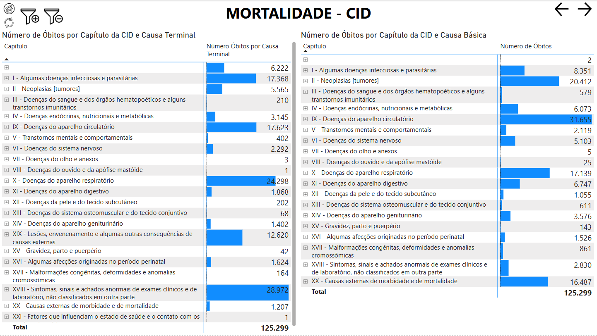
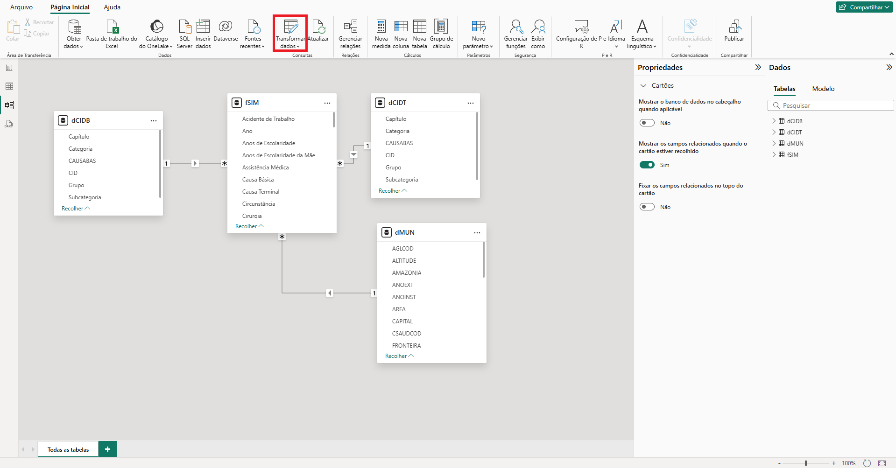

# PaSim

This repository contains an R package called "PaSim" that provides functions for accessing and processing data from DATASUS (Department of Informatics of the Unified Health System) and updating the corresponding Power BI dashboard models.

## Overview

The "PaSim" package was designed to simplify and accelerate the process of obtaining DATASUS data, processing this data, and updating the Power BI dashboard models. With the use of this package, users can automate these tasks and save valuable time.

#### The visualization of the dashboards will be similar to this:

{width="280"} {width="280"}

{width="280"} {width="280"}

## Features

The "PaSim" package has the following main features:

1.  Access to DATASUS data: The package allows users to directly access DATASUS data through specific functions. These functions facilitate the query and extraction of the necessary data for updating the dashboards.

2.  Data processing: Once the data is obtained from DATASUS, the package provides functions to process this data. This includes cleaning, transforming, and organizing the data, ensuring it is ready to be used in the Power BI dashboard models.

3.  Update of Power BI dashboard models: The package automates the process of updating Power BI dashboard models. It integrates seamlessly with Power BI and allows users to update the data and graphs of the dashboards with just a few commands.

## How to use the package

To start using the "PaSim" package, follow the steps below:

1.  Install the package:

``` r
install.packages("remotes")
remotes::install_github("abelbrasil/PaSim")
```

2.  Load the package: Use the `library(PaSim)` command to load the package into your R environment.

3.  Access the DATASUS data: Use the functions provided by the package to access and extract the DATASUS data you want to use in your Power BI dashboards.

4.  Compile the function with the desired parameter information: The functions of the package download the data from the requested Information System, process the data, performing cleanings, transformations, and organization as necessary for the base to be readable to become useful information on the dashboard.

5.  Update the Power BI dashboard models: After save the .RData file, open the Power BI and change the source of the data, importing the new database through the R code.

## Functions

-   `download.SIM` is the primordial function of this package. This function is responsible to download the data from the DATASUS FTP Directory. The user enters with the year and the state they want and the output is a data frame with the raw information.

-   `label.SIM` needs a data frame created by the function `download.SIM` and this function is responsible to choose the util columns, clean the data and replace the code by the respective labels.

-   `panel.SIM` is used to select and handle the columns required for the Power BI dashboard.

## Example

``` r
library(PaSim)
data <- download.SIM(UF = "CE", inicio = 2021, fim = 2023)
data_processed <- process.SIM(data)
fSIM <- panel.SIM(data_processed)
dCIDB <- CID
dCIDT <- CID
dMUN <- CADMUN
rm(SIM, SIML)
save.image(file = "database.Rdata")
```

## How to use the dashboard

After open the file `Painel Mortalidade` avaliable in \inst\extdata,




## Contributing

If you would like to contribute to the development of the "PaSim" package, feel free to fork this repository and submit pull requests with your improvements. Your contribution will be greatly appreciated!

## Issues and Feedback

If you encounter any issues while using the "PaSim" package or have any suggestions for improvement, please open an issue in this repository. We will do our best to solve the problems and meet your needs.

### Possible errors that can be encountered

There may be connection errors. In these cases, it is necessary to run the function again.

Legal Notice This "PaSim" package is provided without any warranty of any kind. Use at your own risk.

License The "PaSim" package is distributed under the MIT license. See the LICENSE file for more details.

Contact For more information or questions related to this package, please contact the developer:

Name: [Luan Augusto Sousa Nascimento] Email: [[luanguto87\@gmail.com](mailto:luanguto87@gmail.com){.email}]
